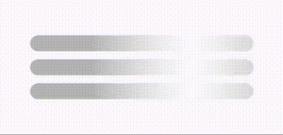

## Shimmer with Delay

This example demonstrates how to create a shimmer effect with a delay using the [shimmer](https://pub.dev/packages/shimmer) package.

Typically, a shimmer effect is used to indicate that the content is loading. Also, the shimmer animation is looping repeatedly without any pause. Like this:

However, in this example, we will cover this custom use cases:
- Add a shimmer on top of a Widget (with Stack)
- Add a delay before the next shimmer animation starts.

### Example Specifications

- The shimmer effect will be displayed on top of a "Hello, World!" Container Widget.
- The shimmer effect will have a delay of 3 seconds before the next shimmer animation starts.
- The shimmer animation will have 1.5 seconds of duration.

### Result

